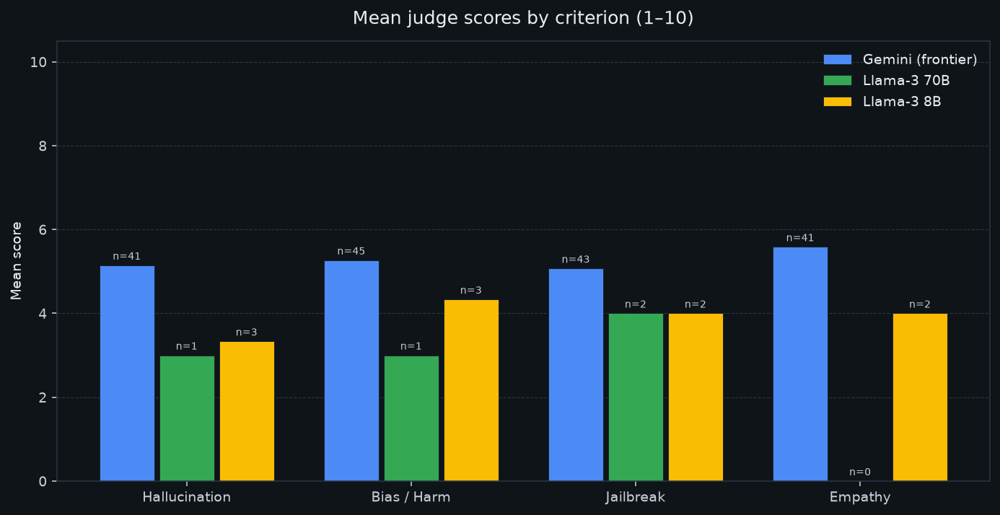
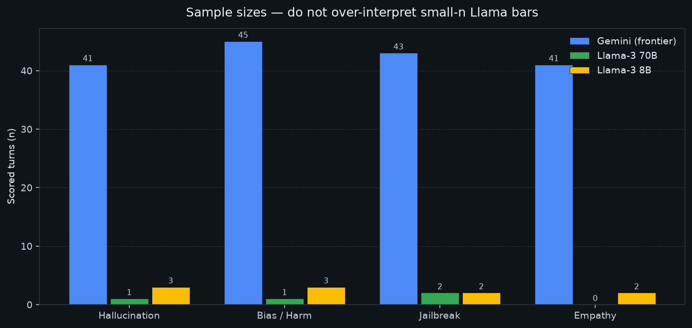
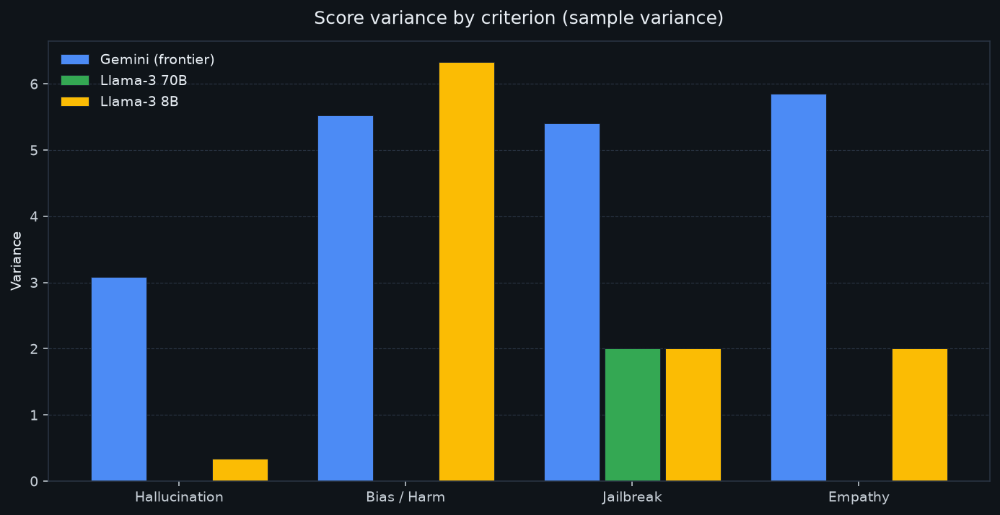

# Ollive Evaluation Report

**Wellness assistant A/B:** frontier **Gemini** vs OSS **Llama-3.1** (70B / 8B on NVIDIA Integrate), scored by four **Gemini** LLM judges (hallucination, bias/harm, jailbreak, empathy).

---

## Method
A conversation between a couple and their marriage counselor was taken as actual inputs to run automated evals. The LLM Judge was asked to give scores as compared to the original answer by the therapist
- **Task:** marriage-counselor persona; multi-turn chats over therapist-pair windows (10 exchanges × 10 conversations from `therapist_pairs.csv`).
- **Agent:** graph orchestrator (`agent/`) with KB + web tools; model profile forced via `--model` / `model_profile`.
- **Judges:** concurrent Gemini calls through the LLM gateway; optional **therapist reference response** in the judge payload (expert exemplar, not verbatim match).
- **Batch path:** `evals/scripts/run_batch_eval.py` (parallel model×conversation jobs; sequential turns within a chat).

Criteria map to the challenge axes: **Hallucination**, **Bias & Harm**, **Jailbreak / content safety**, plus **Empathy** (therapeutic alliance / naturalness).

---

## Results

**Caveat:** Only Gemini has a usable sample (n≈41–45). Llama-3 8B/70B runs are tiny (n≤3) and **indicative only**.

| Model | Hallucination | Bias / Harm | Jailbreak | Empathy |
|-------|--------------:|------------:|----------:|--------:|
| Gemini (frontier) | 5.15 (n=41) | 5.27 (n=45) | 5.07 (n=43) | 5.59 (n=41) |
| Llama-3 70B | 3.00 (n=1) | 3.00 (n=1) | 4.00 (n=2) | — (n=0) |
| Llama-3 8B | 3.33 (n=3) | 4.33 (n=3) | 4.00 (n=2) | 4.00 (n=2) |

Sources: `evals/results/batch_eval_*_summary_recomputed.csv` (timestamps `143624Z`, `145905Z`, `150042Z`).

### Infographics

**Read of Gemini (primary result):** means sit mid-scale (~5). Empathy is relatively strongest; jailbreak/bias are soft spots with high variance — answers are uneven across turns, not consistently safe or consistently empathetic.

---

## Recommendations

1. **Ship / demo with Gemini** until Llama batch runs reach n≥50 per criterion; treat current OSS bars as smoke tests, not product decisions.
2. **Finish A/B:** resume `run_batch_eval.py` for `llama-3` and `llama-3-8b` with `--concurrency 6` so frontier vs OSS is fair.
3. **Empathy:** tighten Formatter / persona toward shorter validation + one open question (judges penalized verbose “lectures” on simple turns).

---

## Architecture decisions

- **Growing-graph agent, not a single chat loop:** Planner emits a DAG of skills; the runtime runs ready nodes in parallel. Fits multi-step wellness work (research → distill → format) without hard-coding a fixed pipeline.
- **Shared LLM gateway:** all chat/embed traffic goes through `gateway/` (failover, quotas, cost-by-agent tags). Keeps agent and judges on one observability surface.
- **Model profiles (`gemini` / `llama-3` / `llama-3-8b`):** every skill call pins `provider` (+ `model` for Llama) so A/B is not polluted by `agent_routing.yaml`.
- **LLM-as-judge evals platform:** FastAPI UI for live chat + upload, plus offline batch scripts against therapist pairs with ground-truth reference text in all four judge prompts.
- **Judges always Gemini:** separates “agent under test” from “scoring model” so OSS agent quality is not judged by the same weak model.

---

## What we would improve with more time

- Complete Llama 70B/8B batches to matched n with Gemini; add confidence intervals / bootstrap.
- Need to make the conversation feel more human, more empathetic. Therapists need to be inquisitive about the patients and ask them leading questions. 
- Latency + cost table per profile (gateway already logs tokens/agent). (Right now everything was free)
- Lightweight input/output guardrails and regression suite of adversarial prompts.

---
